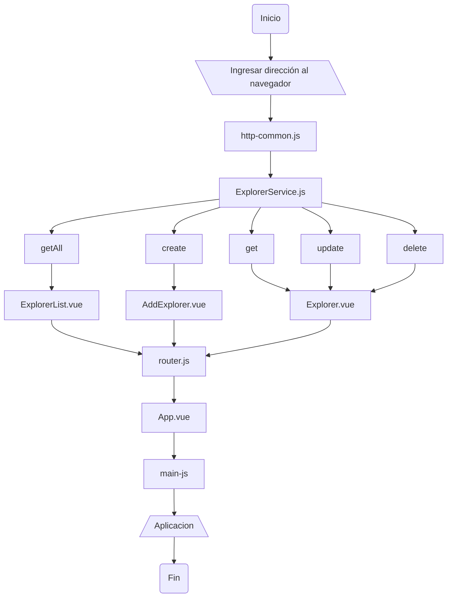

# Documentacion

Proceso del flujo de la aplicación

## Algoritmo

1. Entrar a la pagina web en el navegador
    - Entrar a la pagina de ver todos los datos: `http://localhost:8081/explorers`
    - Entrar a la pagina de crear un dato datos: `http://localhost:8081/add`
    - Entrar a la pagina editar un dato: `http://localhost:8081/explorer/:id`
2. Usar ruta backend mediante `http-common.js` con el paquete axios 
    - Ruta de backend: `http://localhost:3000`
    - Headers: `"Content-type": "application/json"`
3. Traspasar diferentes rutas al archivo `service/ExplorerService` importando el archivo `http-common.js`
    - Ver todos los datos: `getAll()`
    - Crear un dato: `create(data)`
    - Ver un dato: `get(id)`
    - Editar un dato: `update(id, data)`
    - Eliminar un dato: `delete(id)`
4. Se envia la informacion del `ExplorerService` a los componentes
    - Vista `AddExplorer.vue` con la funcion `create(data)`
    - Vista `Explorer.vue` con las funciones `get(id)`, `update(id, data)` y `delete(id)`
    - Vista `ExplorerList.vue` con la funcion `getAll()`
5. Se crea la ruta y se complementan junto con los components mediante el archivo `router.js`
    - Path: `/`, Alias: `/explorers`, Name: `explorers`, Components: `ExplorerList.vue`
    - Path: `/explorer/:id`, Name: `add-explorers`, Components: `AddExplorer.vue`
    - Path: `/add`, Name: `add-explorers`, Components: `AddExplorer.vue`
6. La información de las rutas va al archivo `App.vue` que servira como vista al navegador
7. Al final el funcionamiento de la aplicacion se envia al archivo `main.js`

## Diagrama de flujo

